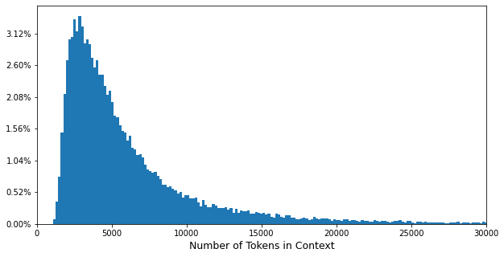

# Preprocessing

## Load "Train" Data

/KorQuADv2/의 압축 파일들을 unzip하고 나서, (.zip파일이 아닌) .json파일들만을 load.

.json파일들에서 document들을 추출하여 list형태로 반환.

KorQuADv2의 train set은 **38,496개**의 document로 구성.

> **load_data** in **utils.py** Line 6

```python
def load_data(path='./KorQuADv2/', sort="train"):
    # Load .json files, not .zip files.
    files=[]
    for file in os.listdir(path):
        if file.split(".")[-1]=="json":
            files.append(file)

    # Load "train" or "dev" data.
    datas=[]
    for file in sorted(files):
        if file.split("_")[1]==sort:
            print(file)
            with open(path+file, 'r') as f:
                datas.append(json.load(f))
                f.close()
    
    # Extract documents from data.
    documents=[]
    for data in datas:
        for document in data['data']:
            documents.append(document)
    print("Total", len(documents), "Documents")

    return documents
```

> **Run**

```python
from utils import load_data
documents_train=load_data(path='./KorQuADv2/', sort="train")
```

> **Results**

```bash
korquad2.1_train_00.json
korquad2.1_train_01.json
korquad2.1_train_02.json
(..truncated..)
korquad2.1_train_36.json
korquad2.1_train_37.json
korquad2.1_train_38.json
Total 38496 Documents
```

## Data Analysis

train set의 경우 1개의 document에서 평균 **2.17개**의 질의응답 쌍, 총 **83,486개**의 질의응답 쌍이 존재.

document는 dictionary형태로 **"context"** key를 통해 본문에, **"qas"** key를 통해 질의응답 쌍 list에 접근 가능.

질의응답 쌍 역시 dictionary형태로 **"question"** 과 **"answer"** key로 **질문**과 **정답** 정보에 접근 가능.

정답 정보에는 정답 텍스트(**"text"**)와 context에서의 정답의 시작 위치(**"answer_start"**) 등이 포함.

> **Run**

```python
nums_qas=[]
for document in documents_train:
    nums_qas.append(len(document['qas']))
print("Total", sum(nums_qas), "QAs")
print("Average", sum(nums_qas)/len(nums_qas), "QAs")
```

> **Results**

```bash
Total 83486 QAs
Average 2.16869285120532 QAs
```

> **Run**

```python
print(documents_train[7777]['context'])
```

> **Results**

```bash
<!DOCTYPE html>
<html>
<head>
<meta>
<title>설정 - 위키백과, 우리 모두의 백과사전</title>
(..truncated..)
<h2><span></span><span>이야기에서의 중요성</span><span><span>[</span><a>편집</a><span>]</span></span></h2>
<p>설정이 없으면 이야기는 전혀 진행하지 않게 된다. 등장인물들이 상대의 이름을 부르는 것만으로도 '이름'이라는 설정이 필요하며, 이들이 어디에 있을지도 결정하지 않으면 안 된다. 이들의 복장을 결정하기 위해서도 시대 설정이나 인물 설정이 필요하다. <a>육하원칙</a>에서의 '언제·어디서·누가·왜·무엇을·어떻게'라는 요소 가운데, '언제·어디서·누가'라는 최소한의 부분에서 직접 설정이 관련되며, '왜·무엇을'의 부분에는 인물의 성별이나 성격, 취미, 취향 등이 영향을 준다.
</p><p>설정은 이야기의 구성을 결정하는 데 중요한 항목이기 때문에, 한 번 설정을 한 것을 쉽게 바꿀 수는 없다. 예를 들어, 일본을 주된 무대로 하고 있었음이 분명한 이야기의 배경이 갑자기 유럽으로 옮겨지거나, 남자였음이 분명한 등장인물이 갑자기 여자가 되면 이야기의 정합성이 잡히지 않게 되어, 이야기 그 자체가 무너져 버리게 되는 것이다. 이야기의 정합성을 취하기 위해서 나중에 설정이 더해지거나 없었던 일로 되거나 하는 경우도 있는데, 그것은 일반적으로 부록 설정이라 한다.
</p>
(..truncated..)
</body>
</html>
```

> **Run**

```python
for qa in documents_train[7777]['qas']:
    print("="*125)
    print(qa['question'])
    print("="*125)
    for key in qa['answer'].keys():
        print("\"", key, "\"")
        print(qa['answer'][key])
        print("")
```

> **Results**

```bash
=============================================================================================================================
왜 설정이 이야기에서 중요한가요?
=============================================================================================================================
" text "
<p>설정은 이야기의 구성을 결정하는 데 중요한 항목이기 때문에, 한 번 설정을 한 것을 쉽게 바꿀 수는 없다. 예를 들어, 일본을 주된 무대로 하고 있었음이 분명한 이야기의 배경이 갑자기 유럽으로 옮겨지거나, 남자였음이 분명한 등장인물이 갑자기 여자가 되면 이야기의 정합성이 잡히지 않게 되어, 이야기 그 자체가 무너져 버리게 되는 것이다. 이야기의 정합성을 취하기 위해서 나중에 설정이 더해지거나 없었던 일로 되거나 하는 경우도 있는데, 그것은 일반적으로 부록 설정이라 한다.
</p>

" html_answer_start "
10776

" html_answer_text "
<p>설정은 이야기의 구성을 결정하는 데 중요한 항목이기 때문에, 한 번 설정을 한 것을 쉽게 바꿀 수는 없다. 예를 들어, 일본을 주된 무대로 하고 있었음이 분명한 이야기의 배경이 갑자기 유럽으로 옮겨지거나, 남자였음이 분명한 등장인물이 갑자기 여자가 되면 이야기의 정합성이 잡히지 않게 되어, 이야기 그 자체가 무너져 버리게 되는 것이다. 이야기의 정합성을 취하기 위해서 나중에 설정이 더해지거나 없었던 일로 되거나 하는 경우도 있는데, 그것은 일반적으로 부록 설정이라 한다.
</p>

" answer_start "
2108
(..truncated..)
```

## HTML Tags

KorQuADv2에는 HTML Tag들이 등장.

그러나, 일반적으로 HTML Tag들은 Wordpiece(혹은 Sentencepiece) Tokenizer의 Vocab에 포함되지 않음.

-> tokenizing 결과 HTML Tag들을 모두 분해 해버림.

> **Run**

```python
# Load pre-trained tokenizer
from transformers import ElectraTokenizer
tokenizer=ElectraTokenizer.from_pretrained("monologg/koelectra-base-v3-discriminator")

print(documents_train[666]['context'].split("\n")[50])
print("")
print(" ".join(tokenizer.tokenize(documents_train[666]['context'].split("\n")[50])))
```

> **Results**

```bash
<td colspan="2"><a></a><br/>2006년 10월 23일에 준공한 MBC충북 청주방송국 <br/> 現 가경동 사옥

< t ##d col ##sp ##an = " 2 " > < a > < im ##g > < / a > < br / > 2006 ##년 10 ##월 23 ##일 ##에 준공 ##한 MBC ##충 ##북 청주 ##방송 ##국 < br / > 現 가 ##경 ##동 사옥
```

즉, HTML Tag들은 일종의 **"Domain-Specific"** 한 단어들로 생각할 수 있음!

Google BERT 저자에 의하면 Domain-Specific한 단어들은 다음과 같이 처리할 수 있음.

[https://github.com/google-research/bert/issues/9](https://github.com/google-research/bert/issues/9)

본 프로젝트에서는 HTML Tag들을 Vocab의 **[unusedX]** 토큰들과 교체하고 Special Tokens에 추가하는 방식으로 처리!

train set에 등장하는 모든 HTML Tag들을 탐색.

> **Run**

```python
import re

tags_html=[]
for document in documents_train:
    tags_html=list(set(tags_html+re.findall("<[^>]*>", document['context'])))
print("Total", len(tags_html), "Tags")
print("")
for tag in sorted(tags_html):
    print(tag)
```

> **Results**

```bash
Total 643 Tags

<!DOCTYPE html>
</a>
(..truncated..)
<table>
<tbody>
<td colspan="">
<td colspan="0">
<td colspan="1" rowspan="1">
<td colspan="1" rowspan="10">
<td colspan="1" rowspan="11">
(..truncated..)
<td rowspan='1"'>
<td rowspan='2"'>
<td rowspan='3"'>
<td rowspan='6"'>
<td>
<th colspan="">
<th colspan="0">
<th colspan="1" rowspan="2">
<th colspan="1" rowspan="3">
(..truncated..)
<th rowspan='3"'>
<th rowspan='33"'>
<th rowspan='4"'>
<th>
(..truncated..)
<wbr/>
<wbr>
```

위 HTML Tag들을 살펴보면 **"td"**, **"th"** Tag들이 속성으로 가지는 "colspan" 혹은 "rowspan"의 값에 따라 각기 다르게 추가되어 있음.

속성 값의 의미를 유지하며 위의 문제를 해결하기 위해 다음과 같은 방식으로 전처리를 수행.

> \<td colspan="3" rowspan="1"> -> \<td cs rs>3 1
<br/>\<td colspan="7" rowspan="10"> -> \<td cs rs>7 10
<br/>\<th colspan="12"> -> \<th cs>12
<br/>\<th rowspan="23"> -> \<th rs>23

> **preprocess** in **utils.py** Line 70

```python
def preprocess(documents):
    for idx, document in enumerate(documents):
        context=document['context']

        # Replace "td" tags.
        tags_td=list(set(re.findall("<td[^>]*>", context)))
        for tag in tags_td:
            context=re.sub(tag, replace_table_tags(tag=tag, sort="td"), context)

        # Replace "th" tags.
        tags_th=list(set(re.findall("<th[^>]*>", context)))
        for tag in tags_th:
            context=re.sub(tag, replace_table_tags(tag=tag, sort="th"), context)
        
        documents[idx]['context']=context
```

> **replace_table_tags** in **utils.py** Line 31

```python
def replace_table_tags(tag, sort):
    soup=BeautifulSoup(tag, 'html.parser')

    if sort=="td":
        try:
            colspan=soup.td['colspan']
        except(ValueError, KeyError):
            colspan=None

        try:
            rowspan=soup.td['rowspan']
        except(ValueError, KeyError):
            rowspan=None

    if sort=="th":
        try:
            colspan=soup.th['colspan']
        except(ValueError, KeyError):
            colspan=None

        try:
            rowspan=soup.th['rowspan']
        except(ValueError, KeyError):
            rowspan=None
    
    if colspan is not None and rowspan is not None:
        tag_replaced="<{} cs rs>{} {}".format(sort, colspan, sort, rowspan)
    elif colspan is not None and rowspan is None:
        tag_replaced="<{} cs>{}".format(sort, colspan)
    elif colspan is None and rowspan is not None:
        tag_replaced="<{} rs>{}".format(sort, rowspan)
    else:
        tag_replaced="<{}>".format(sort)
            
    if len(tag)>len(tag_replaced):
        tag_replaced=tag_replaced+" "*(len(tag)-len(tag_replaced))

    return tag_replaced
```

> **Run**

```python
# Preprocess data.
from utils import preprocess
preprocess(documents_train)
```

전처리 후 HTML Tag들을 재탐색하여 Tokenizer Vocab에 추가.

> **Run**

```python
tags_html=[]
for document in documents_train:
    tags_html=list(set(tags_html+re.findall("<[^>]*>", document['context'])))
print("Total", len(tags_html), "Tags")
print("")
for tag in sorted(tags_html):
    print(tag)

# Replace [unusedX] tokens with HTML Tags.
# Add HTML Tags to special tokens.
for idx, tag in enumerate(sorted(tags_html)):
    tokenizer.vocab[tag]=tokenizer.vocab["[unused{}]".format(idx)]
    del tokenizer.vocab["[unused{}]".format(idx)]
tokenizer.add_special_tokens({'additional_special_tokens':sorted(tags_html)})
```

> **Results**

```bash
Total 196 Tags

<!DOCTYPE html>
</a>
(..truncated..)
<table>
<tbody>
<td cs rs>
<td cs>
<td rs>
<td>
<th cs rs>
<th cs>
<th rs>
<th>
<title>
(..truncated..)
<wbr/>
<wbr>
```

전처리 및 HTML Tag들 Vocab 추가 이후.

> **Run**

```python
print(documents_train[666]['context'].split("\n")[50])
print("")
print(" ".join(tokenizer.tokenize(documents_train[666]['context'].split("\n")[50])))
```

> **Results**

```bash
<td cs>2        <a></a><br/>2006년 10월 23일에 준공한 MBC충북 청주방송국 <br/> 現 가경동 사옥

<td cs> 2 <a>  </a> <br/> 2006 ##년 10 ##월 23 ##일 ##에 준공 ##한 MBC ##충 ##북 청주 ##방송 ##국 <br/> 現 가 ##경 ##동 사옥
```

## Contexts Length

document들의 context를 tokenizing한 sequence length는 다음과 같은 분포를 따름.

Transformer Encoder기반의 모델들(BERT 등)은 input sequence의 max length(**512**)가 고정되어 있음.

-> context length가 긴 KorQuADv2를 학습시키기 위해 **context segmentation**을 수행! (추후에)

> **Run**

```python
import pickle
with open('./pickles/contexts_encoded.pkl', 'rb') as f:
    contexts_encoded=pickle.load(f)
    f.close()

len_contexts=[]
for context in contexts_encoded:
    len_contexts.append(len(context))
print(len(len_contexts),"Contexts")
print("")

print("Shortest Length",min(len_contexts))
print("Longest Length",max(len_contexts))
print("AVG Length",sum(len_contexts)/len(len_contexts))
print("Cumulative 90%",sorted(len_contexts,reverse=True)[int(len(len_contexts)/10)])
```

> **Results**

```bash
38496 Contexts

Shortest Length 1080
Longest Length 253818
AVG Length 6488.835021820449
Cumulative 90% 12314
```

> **Run**

```python
import matplotlib.pyplot as plt
import matplotlib.ticker as ticker

fig=plt.figure(figsize=(10,5))
ax=fig.add_subplot()
ax.hist(len_contexts,bins=1500,cumulative=False)
ax.yaxis.set_major_formatter(ticker.PercentFormatter(xmax=len(len_contexts)))
ax.set_xlim([0,30000])
ax.set_xlabel("Number of Tokens in Context",fontsize=12.5)
plt.show()
```


